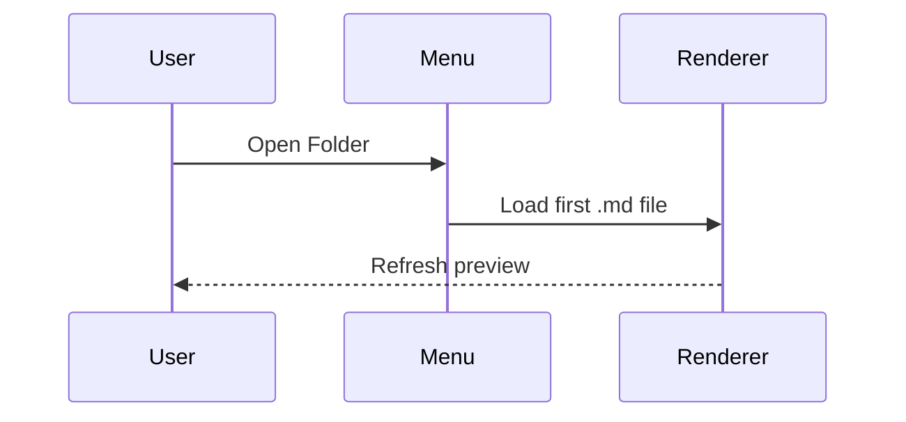
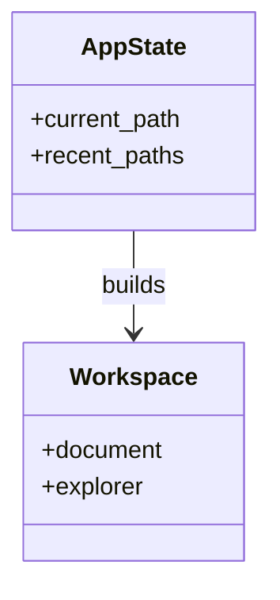
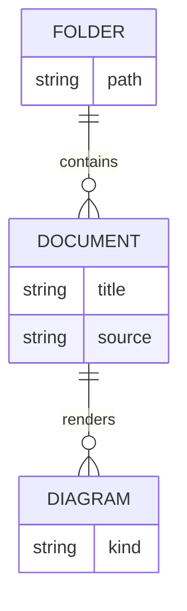
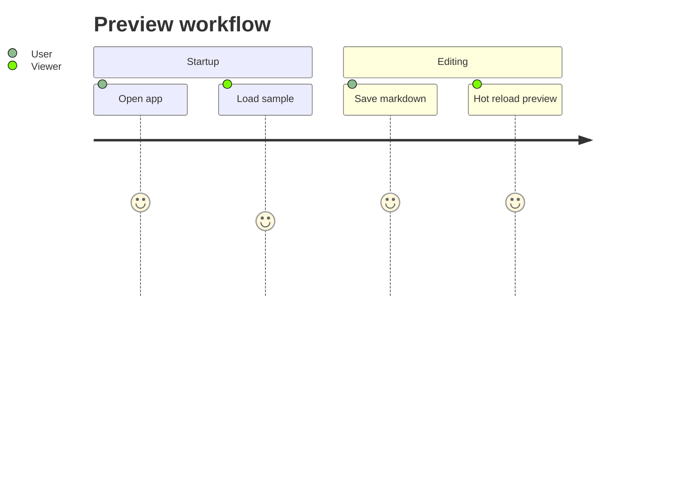
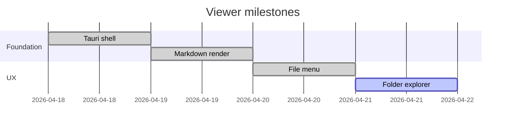
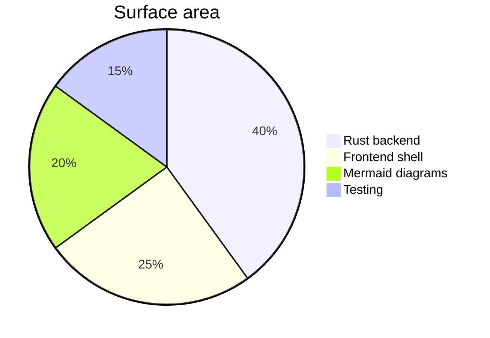
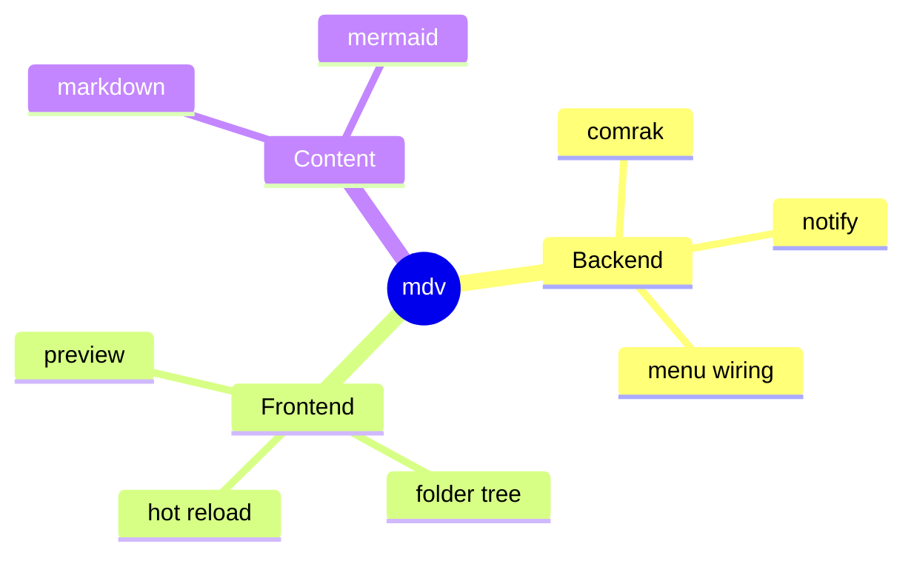

# Mermaid Showcase

This sample document is meant to stress the default viewer with several Mermaid diagram families in one file.

## Flowchart

## Sequence Diagram

## Class Diagram

## ER Diagram

## Journey

## Gantt

## Pie

## Mindmap

## Notes

- The viewer only accepts `.md` files.
- Opening a folder shows directories plus Markdown files in the sidebar.
- Recent files are persisted and capped at ten entries.
