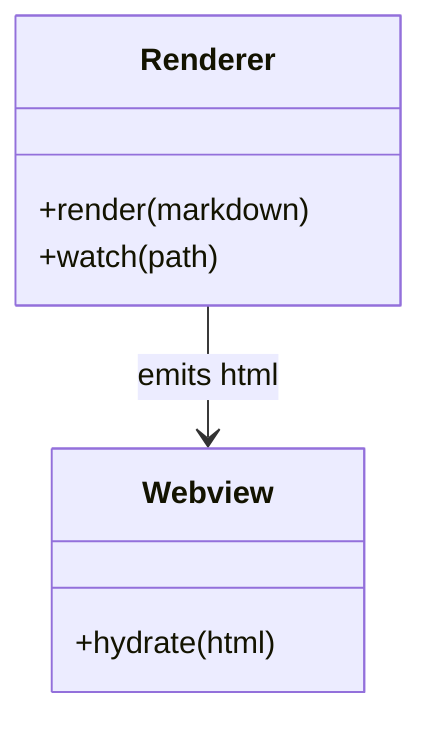
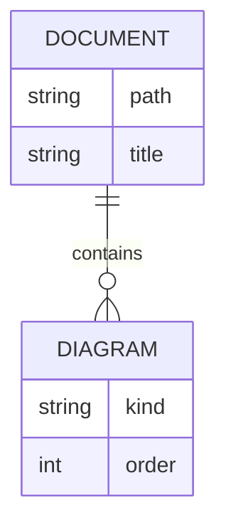

# Class And ER

The renderer should keep list and table HTML around Mermaid blocks.

| Piece | Responsibility |
| --- | --- |
| Renderer | Transform Markdown |
| Webview | Run Mermaid |

- One
- Two

