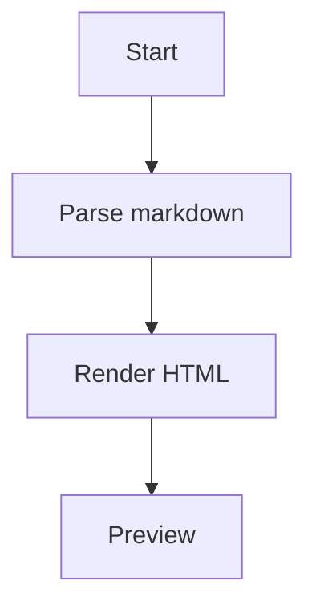

# Flow And Sequence

This fixture mixes common Markdown with two Mermaid blocks.



Regular Markdown should still work with **bold** copy and a fenced code block:

```json
{
  "viewer": "mdv",
  "supportsMermaid": true
}
```

~~~mermaid
sequenceDiagram
    participant User
    participant Viewer
    User->>Viewer: Open document
    Viewer-->>User: Refresh preview
~~~

