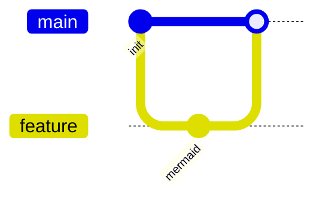
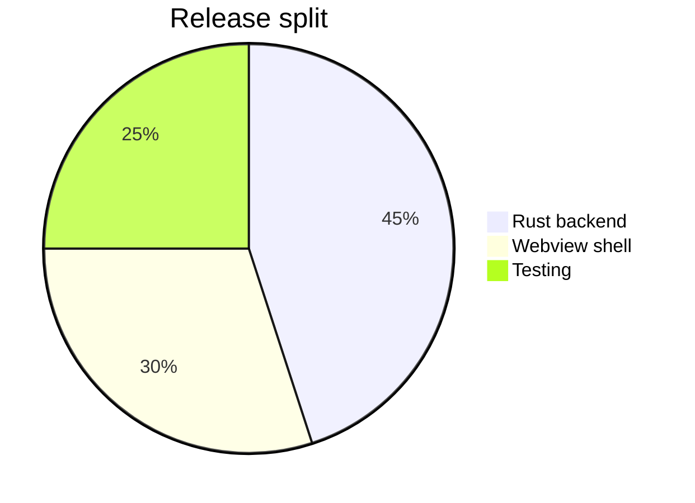

# GitGraph And Pie

This file also exercises `inline code`.

```mermaid
gitGraph
    commit id: "init"
    branch feature
    checkout feature
    commit id: "mermaid"
    checkout main
    merge feature
```

```mermaid
pie title Release split
    "Rust backend" : 45
    "Webview shell" : 30
    "Testing" : 25
```

