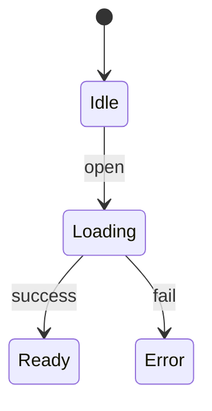
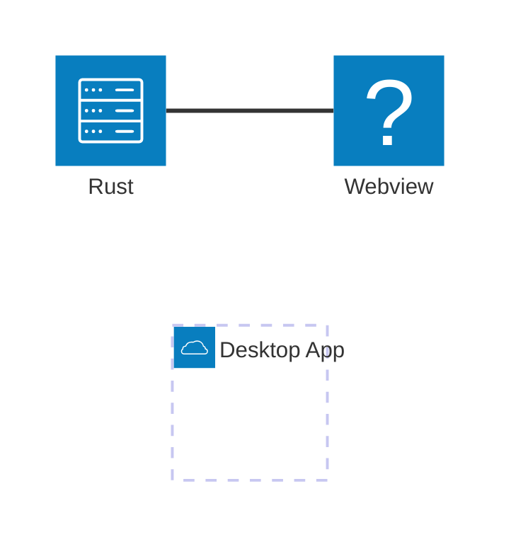

# State And Architecture

The final fixture keeps a standard Rust code fence around Mermaid content.

```rust
fn render_once() -> &'static str {
    "ok"
}
```


```mermaid
stateDiagram-v2
    [*] --> Idle
    Idle --> Loading: open
    Loading --> Ready: success
    Loading --> Error: fail
```


```mermaid
architecture-beta
    group desktop(cloud)[Desktop App]
    service rust(server)[Rust]
    service web(client)[Webview]
    rust:R -- L:web
```
